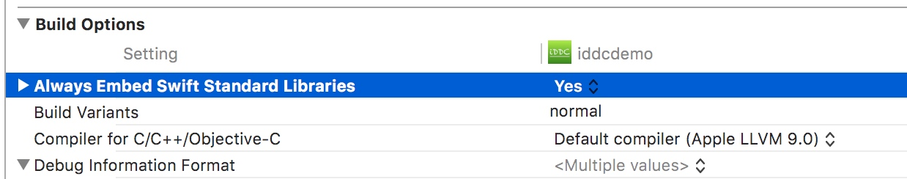
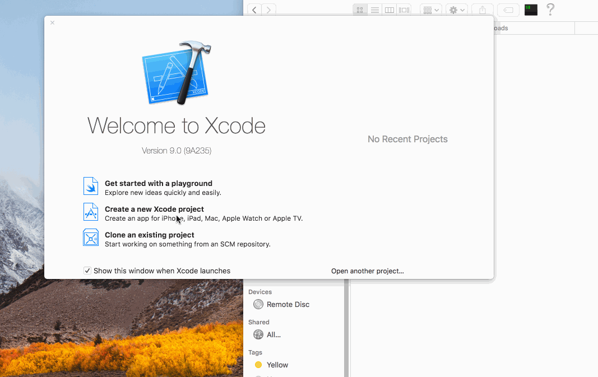

# iOS implementation of iddc.framework

[](https://www.apple.com)   [](https://www.apple.com) [](https://img.shields.io/badge/IDE-Xcode9-lightgrey.svg)

## How to integrate
1. Add the framework into the host App project:
 * Drag & Drop the framework into Xcode Project
    
 > Please select **Copy items if needed**, **Create groups**, **Add to targets**

 * Drag & Drop the framework from **Left Navigator** to **Embedded Binaries**
 


 * (**Objective-C project only**, if the Host App is a Swift project, please skip)Always Embed Swift Standard Libraries: Select your project in **"TARGETS"**(Not PROJECT), click **Build Settings**, Set **Always Embed Swift Standard Libraries** to **Yes** 
           

The GIF below demonstrates the whole process how to integrate the iddc.framework into a new Objective-C project:



#### The iddc.framework is not included in these 2 demo App. If you have the iddc.framework, please put it in `${SRCROOT}/${PROJECT_NAME}` folder
* Objective-C project: `iddc-oc/iddc-oc/iddc.framework`
* Swift project: `iddc-swift/iddc-swift/iddc.framework`

## Use the framework in Objective-C project 

```objective-c
#import "iddc.framework/Headers/iddc-Swift.h"

...
...

/*
initWithKey: License key for DDC
deviceId: Unique id for the device.
deviceIdType: The type for the deviceId, it could be IMEI/GAID/IDFA/PhoneNumber/InstallationId.
*/
DdcManager *ddcManager = [[DdcManager alloc] initWithKey:@"YOUR-LICENSE-KEY" deviceId: @"YOU-DEVICE-ID" deviceIdType: deviceIdType];
[ddcManager runWithCompletion:^(DdcError * error) {    
    if (error == nil || [error code] == 0) {
        NSLog(@"ddc succeed");
    } else {
        NSLog(@"ddc completed with error: %@",error);
    }
}];

```

## Use the framework in Swift project 

```Swift
import iddc

...
...

/*
initWithKey: License key for DDC
deviceId: Unique id for the device.
deviceIdType: The type for the deviceId, it could be IMEI/GAID/IDFA/PhoneNumber/InstallationId.
*/
let deviceId = UIDevice.current.identifierForVendor?.uuidString ?? "uuid-unavailable"
let manager = DdcManager(key: "YOUR-LICENSE-KEY", deviceId: deviceId, deviceIdType: .installationId)
manager.run { (error) in
    if error == nil || error?.code == 0 {
        print("ddc succeed")
    } else {
        print("ddc failed with error ",error!.description)
    }
}
```


DeviceIdType in Objective-C

```objective-c
typedef SWIFT_ENUM(NSInteger, DeviceIdType) {
  DeviceIdTypeImei = 0,
  DeviceIdTypeGaid = 1,
  DeviceIdTypeIdfa = 2,
  DeviceIdTypeIccid = 3,
  DeviceIdTypePhoneNumber = 4,
  DeviceIdTypeInstallationId = 5,
};
```

DeviceIdType in Swift

```Swift
public enum DeviceIdType : Int {
    case imei
    case gaid
    case idfa
    case iccid
    case phoneNumber
    case installationId
}
```


## Input Parameters:

* **initWithKey**: License key for DDC
* **deviceId**: Unique id for the device.
* **deviceIdType**: The type for the deviceId, it could be IMEI/GAID/IDFA/PhoneNumber/InstallationId.

### Output:
* **[ddcManager runWithCompletion]** returns a DdcError object. If `DdcError == nil or DdcError.code == 0`, that means DDC report succeed. Otherwise you can get the failure reason from `DdcError.description`


## Done


