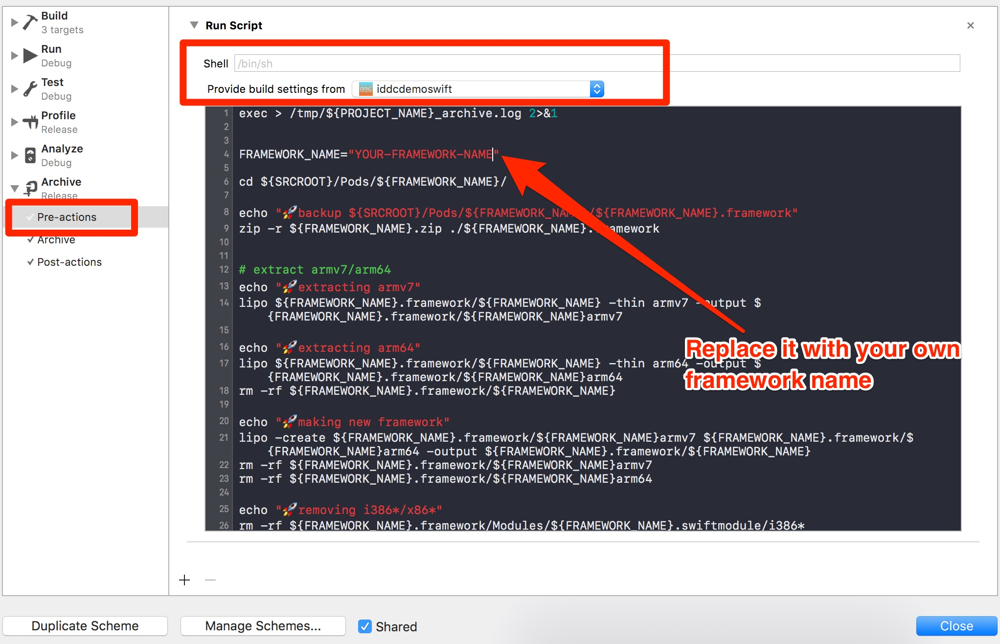
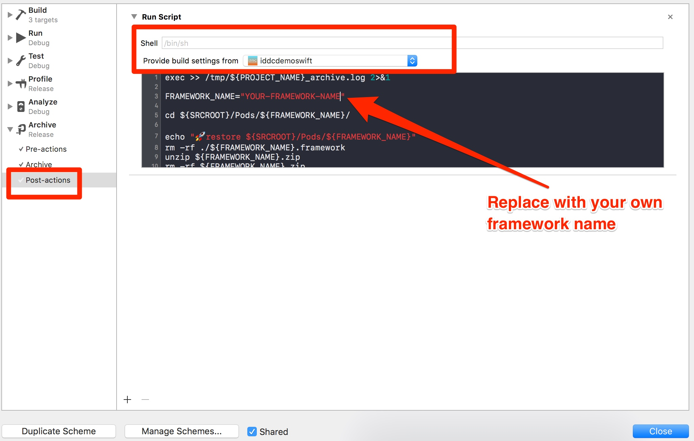

# iddc.framework

[](https://www.apple.com)   [](https://www.apple.com) [](https://img.shields.io/badge/Xcode-9.0-green.svg)

## 1. Example

To run the example project, clone the repo, and run `pod install` from the **iddc-oc** or **iddc-swift** directory first.

## 2. Requirements

## 3. Installation

iOS DDC SDK **iddc** is available through [CocoaPods](http://cocoapods.org). To install
it, simply add the following line to your Podfile:

```ruby
pod 'iddc'
```

* To install iddc.framework, run the script from command-line:
```ruby
pod install
```

* To upgrade iddc.framework, run the script from command-line:

```ruby
pod update
```

## 4. Usage

#### 4.1 Add NSBluetoothPeripheralUsageDescription to Info.list
Since **iddc.framework** need Bluetooth permission to read its status(on/off), it needs to contain an NSBluetoothPeripheralUsageDescription key with a string value explaining to the user how the app uses this data.
But actually, the **iddc.framwork** won't show the permission dialogue at run time.
```xml
<key>NSBluetoothPeripheralUsageDescription</key>
<string>REASON-WHY-NEED-PERMISSION</string>
```
> Please replace **REASON-WHY-NEED-PERMISSION** with some meaningful words.

#### 4.2 Use the framework in Objective-C project 
 * (Objective-C project only)Select your project in **"TARGETS"**(Not PROJECT), click **Build Settings**, Set **Always Embed Swift Standard Libraries** to **Yes** 
           

```objective-c
#import <iddc/iddc.h>

...
...

/*
 initWithKey: License key for DDC
    systemId: the name of the application using/embedding the SDK
    deviceId: Unique id for the device.
deviceIdType: The type for the deviceId, it could be IMEI/IDFA/PhoneNumber/InstallationId.
*/
DdcManager *ddcManager = [[DdcManager alloc] initWithKey:@"YOUR-LICENSE-KEY" systemId: @"YOUR-SYSTEM-ID" deviceId: @"YOU-DEVICE-ID" deviceIdType: deviceIdType];
[ddcManager runWithCompletion:^(DdcError * error) {    
    if (error == nil || [error code] == 0) {
        NSLog(@"ddc succeed");
    } else {
        NSLog(@"ddc completed with error: %@",error);
    }
}];

```

DeviceIdType in Objective-C

```objective-c
typedef SWIFT_ENUM(NSInteger, DeviceIdType) {
  DeviceIdTypeImei = 0,
  DeviceIdTypeIdfa = 2,
  DeviceIdTypeIccid = 3,
  DeviceIdTypePhoneNumber = 4,
  DeviceIdTypeInstallationId = 5,
};
```


#### 4.3 Use the framework in Swift project 

```Swift
import iddc

...
...

/*
         key: License key for DDC
    systemId: the name of the application using/embedding the SDK
    deviceId: Unique id for the device.
deviceIdType: The type for the deviceId, it could be IMEI/IDFA/PhoneNumber/InstallationId.
*/
let manager = DdcManager(key: "YOUR-LICENSE-KEY", systemId: "YOUR-SYSTEM-ID", deviceId: "YOU-DEVICE-ID", deviceIdType: deviceIdType)
manager.run { (error) in
    if error == nil || error?.code == 0 {
        print("ddc succeed")
    } else {
        print("ddc failed with error ",error!.description)
    }
}
```


DeviceIdType in Swift

```Swift
public enum DeviceIdType : Int {
    case imei
    case idfa
    case iccid
    case phoneNumber
    case installationId
}
```

#### 4.4 Output:
* **DdcManager.run()** returns a DdcError object. If `DdcError == nil or DdcError.code == 0`, that means DDC report succeed. Otherwise you can get the failure reason from `DdcError.description`

#### 4.5 Alternatives for triggering DDC
Generally, it is the responsibility of the host-app to trigger the DDC.
Every time the host-app triggers the DDC - the DDC will collect and upload a DDC event.
In order for the collected data to be of maximum business use a certain number of DDC events must be collected over time. 
Fewer DDC events collected means less value can be realised.

Best practise is to trigger DDC based on location updates - however this requires the host-app to have a reason (use case) to subscribe to location updates from iOS.

Other options include tying triggering of DDC to:
* Background fetch
* Audio process

As a last resort, DDC can be triggered when application state changes, e.g. when `func applicationDidEnterBackground(_ application: UIApplication)`, `func applicationWillEnterForeground(_ application: UIApplication)`

......

In our demo [Swift Demo App](./iddc-swift/iddc-swift/ViewController.swift), the DDC collections were triggered when a user tapped a Button.

```swift
@IBAction func buttonPressed(_ sender: UIButton) {
    let deviceId = UIDevice.current.identifierForVendor?.uuidString ?? "uuid-unavailable"
    let manager = DdcManager(key: "YOUR-LICENSE-KEY", systemId: "YOUR-SYSTEM-ID", deviceId: deviceId, deviceIdType: .installationId)
    manager.run { (error) in
        // result handling
    }
}
```

## 5. Upload host App to AppStore

The iddc.framework is a universal framework. The App with this framework can be run in both simulator and real device, but it is not allowed to be uploaded to AppStore.
So we need remove simulator architectures from the framework before we archiving and uploading to AppStore.
#### 5.1 Add [script](https://gist.github.com/zhihuitang/1046b71bf7fe6c169a29405c37f99a66) to **Archive: pre-actions**
Please remember to replace the framework name with **iddc**
  

```shell
exec > /tmp/${PROJECT_NAME}_archive.log 2>&1

FRAMEWORK_NAME="iddc"

cd ${SRCROOT}/Pods/${FRAMEWORK_NAME}/

echo "🚀backup ${SRCROOT}/Pods/${FRAMEWORK_NAME}/${FRAMEWORK_NAME}.framework"
if [ -f "${FRAMEWORK_NAME}.zip" ]
then
    unzip -o ${FRAMEWORK_NAME}.zip
else
    zip -r ${FRAMEWORK_NAME}.zip ./${FRAMEWORK_NAME}.framework
fi

# extract armv7/arm64
echo "🚀extracting armv7"
lipo ${FRAMEWORK_NAME}.framework/${FRAMEWORK_NAME} -thin armv7 -output ${FRAMEWORK_NAME}.framework/${FRAMEWORK_NAME}armv7

echo "🚀extracting arm64"
lipo ${FRAMEWORK_NAME}.framework/${FRAMEWORK_NAME} -thin arm64 -output ${FRAMEWORK_NAME}.framework/${FRAMEWORK_NAME}arm64
rm -rf ${FRAMEWORK_NAME}.framework/${FRAMEWORK_NAME}

echo "🚀making new framework"
lipo -create ${FRAMEWORK_NAME}.framework/${FRAMEWORK_NAME}armv7 ${FRAMEWORK_NAME}.framework/${FRAMEWORK_NAME}arm64 -output ${FRAMEWORK_NAME}.framework/${FRAMEWORK_NAME}
rm -rf ${FRAMEWORK_NAME}.framework/${FRAMEWORK_NAME}armv7
rm -rf ${FRAMEWORK_NAME}.framework/${FRAMEWORK_NAME}arm64

echo "🚀removing i386*/x86*"
rm -rf ${FRAMEWORK_NAME}.framework/Modules/${FRAMEWORK_NAME}.swiftmodule/i386*
rm -rf ${FRAMEWORK_NAME}.framework/Modules/${FRAMEWORK_NAME}.swiftmodule/x86*

```


#### 5.2 Add [script](https://gist.github.com/zhihuitang/69fc4784df749137b5ecf890b3c591e9) to **Archive: post-actions**
Please remember to replace the framework name with **iddc**
  

```shell
exec >> /tmp/${PROJECT_NAME}_archive.log 2>&1

FRAMEWORK_NAME="iddc"

cd ${SRCROOT}/Pods/${FRAMEWORK_NAME}/

echo "🚀restore ${SRCROOT}/Pods/${FRAMEWORK_NAME}"
rm -rf ./${FRAMEWORK_NAME}.framework
unzip -o ${FRAMEWORK_NAME}.zip
rm -rf ${FRAMEWORK_NAME}.zip
```

#### 5.3 Then you can archive your host App as usual.

> Ref: [Your executable contains unsupported architecture](https://dahuayuan.wordpress.com/2017/10/18/how-to-upload-an-app-with-universal-framework/)


