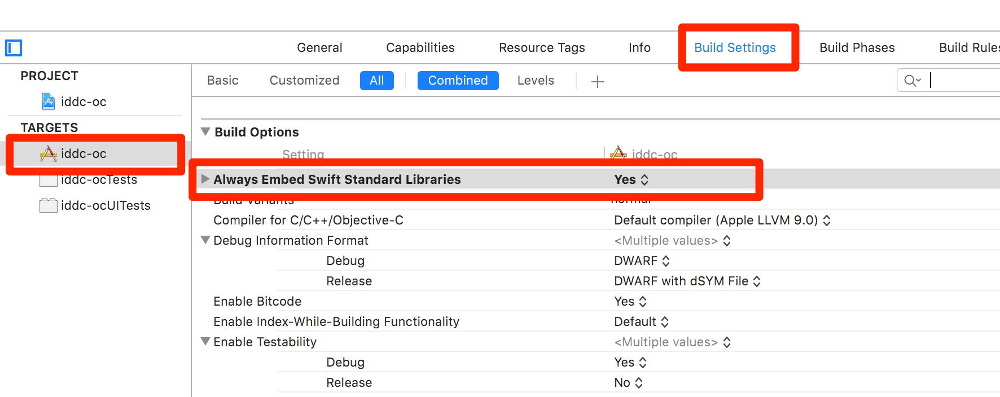

# iddc.framework

[](https://www.apple.com)   [](https://www.apple.com) [](https://img.shields.io/badge/Xcode-9.3-brightgreen.svg)

## 1. Example

To run the example project, clone the repo, and run `pod update` from the **iddc-oc** or **iddc-swift** directory first.
```ruby
pod update
```
 
After installing the Cocoapods library,  double click `*.xcworkspace`(NOT `*.xcodeproj`) to open the project in your Xcode, build & run it.

## 2. Requirements

| iddc.framwork  | Xcode |
| ------------- | ------------- |
| iddc-xcode9.2  | 9.2  |
| iddc-xcode9.3  | 9.3  |


## 3. Installation

iOS DDC SDK **iddc** is available through [CocoaPods](http://cocoapods.org). To install
it, simply add the following line to your Podfile:

```ruby
pod 'iddc-xcode9.3'
# or
# pod 'iddc-xcode9.2'
```

* To install iddc.framework, run the script from command-line:
```ruby
pod install
```

* To upgrade iddc.framework, run the script from command-line:

```ruby
pod update
```

You can get available versions information of the framework by
```ruby
pod trunk info iddc-xcode9.2
```

or 
```
pod trunk info iddc-xcode9.3
```

## 4. Usage

#### 4.1 Add NSBluetoothPeripheralUsageDescription to Info.list
Since **iddc.framework** need Bluetooth permission to read its status(on/off), it needs to contain an NSBluetoothPeripheralUsageDescription key with a string value explaining to the user how the app uses this data.
But actually, the **iddc.framwork** won't show the permission dialogue at run time.
```xml
<key>NSBluetoothPeripheralUsageDescription</key>
<string>REASON-WHY-NEED-PERMISSION</string>
```
> Please replace **REASON-WHY-NEED-PERMISSION** with some meaningful words.

#### 4.2 Use the framework in Objective-C project 
 * (Objective-C project only)Select your project in **"TARGETS"**(Not PROJECT), click **Build Settings**, Set **Always Embed Swift Standard Libraries** to **Yes** 
           

```objective-c
#import <iddc/iddc.h>

...
...

/*
 initWithKey: License key for DDC
    systemId: the name of the application using/embedding the SDK
    deviceId: Unique id for the device.
deviceIdType: The type for the deviceId, it could be IMEI/IDFA/PhoneNumber/InstallationId.
*/
DdcManager *ddcManager = [[DdcManager alloc] initWithKey:@"YOUR-LICENSE-KEY" systemId: @"YOUR-SYSTEM-ID" deviceId: @"YOU-DEVICE-ID" deviceIdType: deviceIdType];
[ddcManager runWithCompletion:^(DdcError * error) {    
    if (error == nil || [error code] == 0) {
        NSLog(@"ddc succeed");
    } else {
        NSLog(@"ddc completed with error: %@",error);
    }
}];

```

> In develop environment, the DDC log output can be enabled by setting:
> ```
> ddcManager.debug = true;
> ```

DeviceIdType in Objective-C

```objective-c
typedef SWIFT_ENUM(NSInteger, DeviceIdType) {
  DeviceIdTypeImei = 0,
  DeviceIdTypeIdfa = 2,
  DeviceIdTypeIccid = 3,
  DeviceIdTypePhoneNumber = 4,
  DeviceIdTypeInstallationId = 5,
};
```


#### 4.3 Use the framework in Swift project 

```Swift
import iddc

...
...

/*
         key: License key for DDC
    systemId: the name of the application using/embedding the SDK
    deviceId: Unique id for the device.
deviceIdType: The type for the deviceId, it could be IMEI/IDFA/PhoneNumber/InstallationId.
*/
let manager = DdcManager(key: "YOUR-LICENSE-KEY", systemId: "YOUR-SYSTEM-ID", deviceId: "YOU-DEVICE-ID", deviceIdType: deviceIdType)
manager.run { (error) in
    guard let ddcError = error else {
        print("DDC succeed")
        return
    }
    
    switch ddcError.code {
    case DdcErrorCode.succeed.rawValue:
        print("DDC succeed")
    case DdcErrorCode.tooManyRequests.rawValue:
        print("DDC failed due to too many requests in short time")
    case DdcErrorCode.ddcIsRunning.rawValue:
        print("DDC failed due to last requst is still running")
    default:
        // failed, other reason
        print("failed: \(ddcError)")
    }
}
```


DeviceIdType in Swift

```Swift
public enum DeviceIdType : Int {
    case imei
    case idfa
    case iccid
    case phoneNumber
    case installationId
}
```

#### 4.4 Output:
* **DdcManager.run()** returns a DdcError object. If `DdcError == nil or DdcError.code == 0`, that means DDC report succeed. Otherwise you can get the failure reason from `DdcError.description`

#### 4.5 Alternatives for triggering DDC
Generally, it is the responsibility of the host-app to trigger the DDC.
Every time the host-app triggers the DDC - the DDC will collect and upload a DDC event.
In order for the collected data to be of maximum business use a certain number of DDC events must be collected over time. 
Fewer DDC events collected means less value can be realised.

Best practise is to trigger DDC based on location updates - however this requires the host-app to have a reason (use case) to subscribe to location updates from iOS. 

Putting the DDC in the system-callback (e.g:`didUpdateToLocation`) event directly(e.g.: `didUpdateToLocation` -> 
`DDC`) ensures separation of concerns and eliminate any risk of impacting other features, and vice versa. 

```objective-c
- (void)locationManager:(CLLocationManager *)manager didUpdateToLocation:(CLLocation *)newLocation fromLocation:(CLLocation *)oldLocation {
    DdcManager *ddcManager = [[DdcManager alloc] initWithKey:@"YOUR-LICENSE-KEY" systemId: @"YOUR-SYSTEM-ID" deviceId: @"YOU-DEVICE-ID" deviceIdType: deviceIdType];
    [ddcManager runWithCompletion:^(DdcError * error) {
        if (error == nil || [error code] == 0) {
            // succeed
            NSLog(@"ddc succeed");
        } else if( [error code] == DdcErrorCodeTooManyRequests ){
            // failed due to too many requests in short time
        } else if( [error code] == DdcErrorCodeDdcIsRunning ){
            // failed due to last request is still running
        } else {
            // failed, other reason
            NSLog(@"ddc completed with error: %@",error);
        }
    }];
}
```

Other options include tying triggering of DDC to:
* Background fetch
* Audio process

As a last resort, DDC can be triggered when application state changes, e.g. when `func applicationDidEnterBackground(_ application: UIApplication)`, `func applicationWillEnterForeground(_ application: UIApplication)`

......

In our demo [Swift Demo App](./iddc-swift/iddc-swift/ViewController.swift), the DDC collections were triggered when a user tapped a Button.

```swift
@IBAction func buttonPressed(_ sender: UIButton) {
    let deviceId = UIDevice.current.identifierForVendor?.uuidString ?? "uuid-unavailable"
    let manager = DdcManager(key: "YOUR-LICENSE-KEY", systemId: "YOUR-SYSTEM-ID", deviceId: deviceId, deviceIdType: .installationId)
    manager.run { (error) in
        // result handling
    }
}
```


