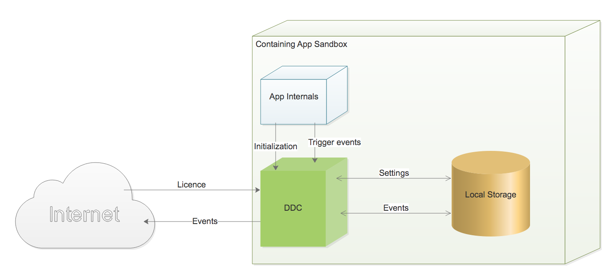
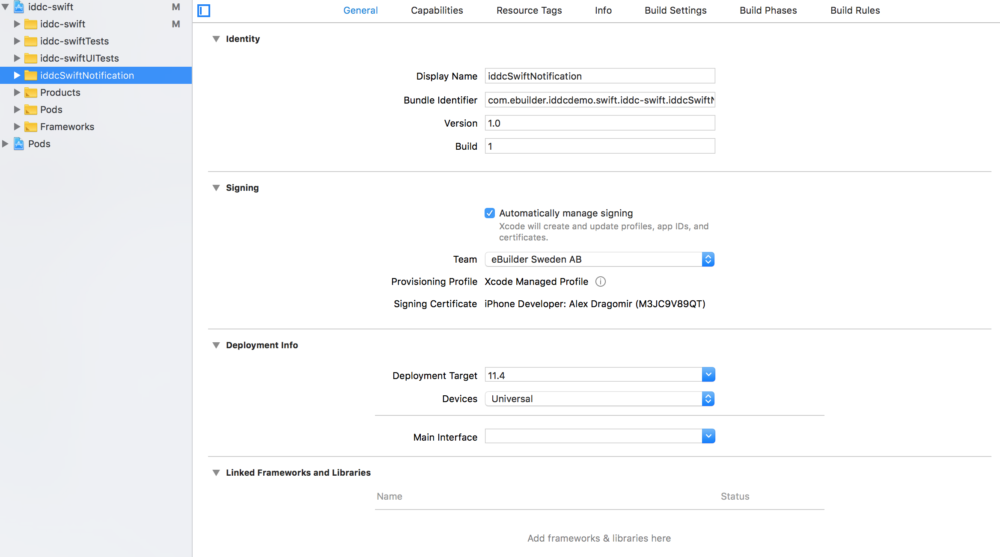

# iOS

The Device Data Collector (**DDC**) for iOS manual and example implementations in [Objective-C](./example-app-oc) and [Swift](./example-app-swift).

[Requirements](#requirements)<br/>[Installation](#installation)<br/>[Usage](#usage)<br/>	&nbsp;&nbsp;&nbsp;&nbsp;&nbsp;&nbsp;[Permissions](#permissions)<br/>	&nbsp;&nbsp;&nbsp;&nbsp;&nbsp;&nbsp;[Use the framework in Objective-C project](#use-the-framework-in-objective-c-project)<br/>	&nbsp;&nbsp;&nbsp;&nbsp;&nbsp;&nbsp;[Use the framework in Swift project](#use-the-framework-in-swift-project)<br/> 	&nbsp;&nbsp;&nbsp;&nbsp;&nbsp;&nbsp;[Associating collected data with a user/device identity](#associating-collected-data-with-a-userdevice-identity)<br/>        &nbsp;&nbsp;&nbsp;&nbsp;&nbsp;&nbsp;[Data collection frequency](#data-collection-frequency)<br/>[Trigger event on push notification](#trigger-event-on-push-notification)<br/>	&nbsp;&nbsp;&nbsp;&nbsp;&nbsp;&nbsp;[How it works](#how-it-works)<br/>	&nbsp;&nbsp;&nbsp;&nbsp;&nbsp;&nbsp;[Shared data with App Groups](#shared-data-with-app-groups)<br/>        &nbsp;&nbsp;&nbsp;&nbsp;&nbsp;&nbsp;[Packaging](#packaging)<br/>	&nbsp;&nbsp;&nbsp;&nbsp;&nbsp;&nbsp;[Create and configure a notification service extension](#create-and-configure-a-notification-service-extension)<br/>	&nbsp;&nbsp;&nbsp;&nbsp;&nbsp;&nbsp;[SDK Usage](#sdk-usage)<br/>	&nbsp;&nbsp;&nbsp;&nbsp;&nbsp;&nbsp;[Push notification requirements](#push-notification-requirements)<br/>	&nbsp;&nbsp;&nbsp;&nbsp;&nbsp;&nbsp;[Example app](#example-app)


## Requirements

| iddc.framework | Xcode |
| -------------- | ----- |
| iddc-xcode10.0 | 10.0  |
| iddc-xcode10.1 | 10.1  |


## Installation

iOS DDC SDK is available through [CocoaPods](http://cocoapods.org). To install it, simply add the following line to your Podfile:

```ruby
pod 'iddc-xcode${XCODE_VERSION}', '${DDC_SDK_VERSION}'
```

[SEE EXAMPLE](./example-app-swift/Podfile#L11)

To install iddc.framework, run the script from command-line:

```sh
$ pod install
```

To upgrade iddc.framework, run the script from command-line:

```sh
$ pod update
```


## Usage

#### Permissions
DDC SDK doesn't need any permissions in order to run (and won't ask for any). If no permissions are set by the host application, DDC will only collect data for which permissions are not required.

However, there are some permissions that improve data quality if already granted to the host application:

##### Access WiFi Information

If Access WiFi capability and Access WiFi Information entitlement are enabled, DDC can collect collect SSID and (hashed) BSSID.

##### NSBluetoothPeripheralUsageDescription

If the host app has an existing use case, and the NSBluetoothPeripheralUsageDescription string is provided in the project's info.plist, DDC can collect information about the Bluetooth adapter and paired devices:

```xml
<key>NSBluetoothPeripheralUsageDescription</key>
<string>DESCRIPTION-OF-USE-CASE</string>
```

##### Push Notifications and App Groups

If enabled, DDC can collect data when the host application receives a push notification - even if it is not opened. Read more in the section [Trigger event on push notification](#trigger-event-on-push-notification).

#### Use the framework in Objective-C project

Select your project in **"TARGETS"** (**not** PROJECT), click **Build Settings**, Set **Always Embed Swift Standard Libraries** to **Yes**:


Import DDC:

```objective-c
#import <iddc/iddc.h>
```

Create an instance:
```objecive-c
DeviceDataCollector *ddc = [DeviceDataCollector getDefaultWithKey: @"YOUR_LICENCE_KEY"];
```

Collect data:

```objecive-c
[ddc runWithCompletion:^(DdcError *error) {
    if (error) {
        NSLog(@"%@",error);
    }
}];
```


#### Use the framework in Swift project

Import DDC:
```Swift
import iddc
```

Create an instance:
```Swift
let ddc = DeviceDataCollector.getDefault(key: "YOUR_LICENCE_KEY")
```

Collect data:
```Swift
ddc.run { error in
    if let err = error {
        print("\(err.description)")
    }
}
```


#### Associating collected data with a user/device identity

The following properties can be used to optionally provide additional user/device identifiers:

| Name           | Description                                                  |
| -------------- | ------------------------------------------------------------ |
| advertisingID  | The [Apple advertising ID](https://developer.apple.com/documentation/adsupport/asidentifiermanager) of a device. |
| externalUserID | The host application's user identity. For example a (unique) user name, a user ID, an e-mail - or a hash thereof. |
| phoneNumber    | The user's phone number.                                     |

These can be set in any order, at any time (once there is a ddc instance) and as many times as needed.

In Objective-C:

```objective-c
ddc.advertisingID = [adID UUIDString];
ddc.externalUserID = @"c23911a2-c455-4a59-96d0-c6fea09176b8";
ddc.phoneNumber = @"+1234567890";
```

In Swift:

```java
ddc.advertisingID(adID);
ddc.externalUserID("c23911a2-c455-4a59-96d0-c6fea09176b8"); 
ddc.phoneNumber("+1234567890");
```

**Note:** user data is encrypted and handled in accordance with EU GDPR.


#### Data collection frequency

The higher the frequency of data collection (DDC events), the greater the business value. The bare minimum is to trigger events on app open ([applicationDidEnterBackground](https://developer.apple.com/documentation/uikit/uiapplicationdelegate/1622997-applicationdidenterbackground )) and/or app close ([applicationWillEnterForeground](https://developer.apple.com/documentation/uikit/uiapplicationdelegate/1623076-applicationwillenterforeground)). Read more about [state transitions here](https://developer.apple.com/documentation/uikit/uiapplicationdelegate#1965924). There's a minimum interval between two events determined by the licence - so calling DDC too often is harmless.  

An alternative  is to trigger DDC based on location updates. This, however, requires the host application to **already have a legitimate reason** (use case) to subscribe to location updates from iOS.

Putting the DDC in the system-callback (e.g: `didUpdateToLocation`) event directly (e.g.: `didUpdateToLocation` ->`DDC`) ensures separation of concerns and eliminates any risk of impacting other features, and vice versa. An example (Objective-C):

```objective-c
- (void)locationManager:(CLLocationManager * )manager didUpdateToLocation:(CLLocation * )newLocation fromLocation:(CLLocation * )oldLocation {
    DeviceDataCollector *ddc = [DeviceDataCollector getDefaultWithKey:@"YOUR_LICENCE_KEY"];
    [ddc runWithCompletion:^(DdcError *error) {
        if (error) {
            NSLog(@"%@",error);
        }
	}];
}
```

Other options include tying triggering of DDC to:
* Background fetch
* Audio process

In our example apps data collection is triggered when a button is pressed. Read below how trigger DDC events from within a **notification service extension** - especially if you are already using one.


## Trigger event on push notification

You can trigger events on a push notification delivery.
To achieve  this functionality you need to implement a [notification service extension](https://developer.apple.com/documentation/usernotifications/unnotificationserviceextension).

### How it works
Although bundled and published within your app, a notification service extension runs as a separate entity. Upon a push notification delivery the notification service is launched to perform needed work such as modify or enrich the content of the notification message. A lifecycle method is called to perform the work and we'll use same call to trigger an event.

#### Shared data with App Groups
The app and the extension run in their own separate sandboxes therefore not sharing data or objects in memory.
However, App Groups feature allows data sharing between apps or between an app and the contained extension(s).

The SDK will be integrated in both the app and the extension and needs to synchronise the state between the two entities.
Once App Groups has been enabled in both the app and the extension the DDC SDK gets to know the path to shared location by getting a hang of the App Group ID.

App Group ID can be any id that is prefixed with "group." and must be declared as a variable named APP_GROUP_ID in Info.plist files of both the app and the extension.

Example:
```
APP_GROUP_ID = group.com.mycompany.myapp
```

To better visualize the role of the shared app group location see the images bellow.



In the figure above we can see that without enabling shared App Groups the DDC is using the sandboxed local storage for persisting settings and events.
Since the extension runs in its own sandbox it doesn't have access to this storage.

As shown in the following figure, the App Groups feature solved the inter-app common storage problem.


The initialization of the DDC  happens only in the app. As we'll see in a section bellow, the extension's DDC will only retrieve the settings from the local storage. Only the app has access to certain user specific settings and therefore only the app can retrieve such data.

If the triggering of events has been implemented in both the app and the extension the local storage serves also the purpose of bundling together the events originating from the app and extension, saving this way extra payload requests.

#### Packaging
Although the app and the extension behave as separate entities at runtime, having minimal inter communication channels, having separate provisioning profiles, separate bundle IDs,  they are packaged together.
There is only one ipa archive file that is published to appstore.

This is depicted in the figure bellow:


#### Create and configure a notification service extension
The notification service extension is created as a new target in the same Xcode project.
It also requires its own provisioning profile.

##### Create a new target for Notification Service extension
Follow the steps bellow in Xcode to add the extension to your project.

###### Step1: File > New > Target ...


###### Step2: Choose Notification Service Extension template


###### Step3: Choose target options


The new Notification Service Extension target is created:



##### Configure App Groups
AppGroups have to be configured for both the app and app extension. Follow the steps bellow.

###### Choose the group id
Let's assume the id is: *group.com.ebuilder.iddcdemo.swift.iddc-swift*

###### Enable the App Groups Capability
App Groups Capability needs to be enabled in both the app and the extension.
For each of the two targets go to Capabilities > App Groups and switch on the capability. Then specify the group id.


###### Add APP_GROUP_ID property to Info.plist
DDC SDK needs to know also the group id in order to discover the shared location. By convention DDC looks in Info.plist for a property called APP_GROUP_ID.
Since the DDC is integrated independently in both the app and the extension we need to specify the property in both targets.

Add following snippet to both Info.plist's:
```xml
<key>APP_GROUP_ID</key>
<string>group.com.ebuilder.iddcdemo.swift.iddc-swift</string>
```


##### Provisioning profile
The extension needs its own provisioning profile. Follow the usual steps to configure the provisioning profile in Apple Developer console. More on [app signing here](https://help.apple.com/xcode/mac/current/#/dev3a05256b8).

#### SDK Usage
Upon the creation of the Notification Service Extension, Xcode creates also a service class with a basic implementation of the callback methods.

##### Install DDC dependencies
Follow the steps below:

###### Step1: Add extension target
In your POD file add a new target:

```ruby
target 'iddcSwiftNotification' do
    pod 'iddc-xcode${XCODE_VERSION}', '${DDC_SDK_VERSION}'
    use_frameworks!
end
```
[SEE EXAMPLE](./example-app-swift/Podfile#L26)

###### Step2: Install

Execute the following commands:
```sh
$ pod repo update
$ pod install
```

Now you should see a new dependency added to your extension under *General > Linked Frameworks and Libraries*:


##### Trigger DDC Event

Xcode has created the following default bare implementation that you need to adjust based on your needs:

```swift
import UserNotifications

class NotificationService: UNNotificationServiceExtension {

    var contentHandler: ((UNNotificationContent) -> Void)?
    var bestAttemptContent: UNMutableNotificationContent?

    override func didReceive(_ request: UNNotificationRequest, withContentHandler contentHandler: @escaping (UNNotificationContent) -> Void) {
        self.contentHandler = contentHandler
        bestAttemptContent = (request.content.mutableCopy() as? UNMutableNotificationContent)

        if let bestAttemptContent = bestAttemptContent {
            // Modify the notification content here...
            bestAttemptContent.title = "\(bestAttemptContent.title) [modified]"

            contentHandler(bestAttemptContent)
        }
    }

    override func serviceExtensionTimeWillExpire() {
        // Called just before the extension will be terminated by the system.
        // Use this as an opportunity to deliver your "best attempt" at modified content, otherwise the original push payload will be used.
        if let contentHandler = contentHandler, let bestAttemptContent =  bestAttemptContent {
            contentHandler(bestAttemptContent)
        }
    }

}
```

Now, to integrate DDC, first import DDC:

```swift
import iddc
```

Then, trigger data collection in the callback method:

```swift
override func didReceive(_ request: UNNotificationRequest, withContentHandler contentHandler: @escaping (UNNotificationContent) -> Void) {

        self.contentHandler = contentHandler
        bestAttemptContent = (request.content.mutableCopy() as? UNMutableNotificationContent)

    	// Note that run() is called without instantiating DDC
        // (that is already done in the main application):
        DeviceDataCollector.run { error in
            if let err = error {
            	print("\(err.description)")
            }
		}

        if let bestAttemptContent = bestAttemptContent {
            // Modify the notification content here...
            // At the moment no modification is required
            contentHandler(bestAttemptContent)
        }
    }

```

#### Push notification requirements
As described in [Apple's documentation](https://developer.apple.com/documentation/usernotifications/unnotificationserviceextension) the push notification must conform to following requirements in order for the extension to be triggered on notification arrival:

```
  - The remote notification is configured to display an alert
  - The remote notification's aps dictionary includes the mutable-content key with the value set to 1
```

  ```json
  {"aps": {"mutable-content": 1}}
  ```


#### Example app
For an example implementation and project configuration see the [example-app-swift](./example-app-swift) in this repository. To setup and test Push Notifications check [Apple's documentation](https://developer.apple.com/documentation/usernotifications).

In brief, following actions and settings need to be performed:

  1. Enable Push Notifications capability in your app:

    

  2. Ask the user's [permission to use notifications](https://developer.apple.com/documentation/usernotifications/asking_permission_to_use_notifications).

  3. Register your app with APN, retrieve app's device token ID and send it to your provider server. As a server you can also use a service provider such as [Pushwoosh](https://www.pushwoosh.com). More details [here](https://developer.apple.com/documentation/usernotifications/registering_your_app_with_apns).
